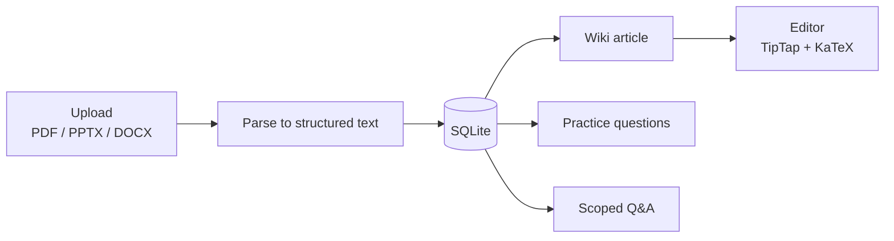

# Knomad

Upload a lecture, get something you can actually revise from. Knomad takes a PDF, PowerPoint or Word file and turns it into a structured wiki article, a set of practice questions, and a chatbot that answers from your own material rather than from the open internet.

**Live at [knomadstudy.co.uk](https://knomadstudy.co.uk).** Solo build — architecture, backend, frontend, deployment and cost control.

This repository is the overview. The application source is private.

---

## Why

I built [Project Atlas](https://github.com/lwilde2004-dot/project-atlas) first, as a private pipeline over my own vault: my machine, my folder layout, one user. Knomad is that idea rebuilt as a product, with the assumptions about my file structure taken out so it works on anyone's material.

## What it does

1. **Ingest.** Accepts PDF, PPTX and DOCX, extracts text and structure, and stores the result against your account.
2. **Generate.** Produces a wiki-style article, then practice questions from the same source.
3. **Ask.** A question-answering layer scoped to your uploaded material, so answers come from what you gave it rather than from the open internet.
4. **Edit.** A rich-text editor with proper maths rendering, because engineering notes are unusable without it.

## Architecture

**Backend** — Node/Express with SQLite (better-sqlite3) on a persistent volume. Document parsing runs through `pdf-parse`, `officeparser`, `mammoth`, and JSZip with `fast-xml-parser` for PowerPoint XML. Auth is Clerk middleware applied globally with per-route guards. `helmet` and `express-rate-limit` on the edge. Billing runs on webhooks verified with `svix`.

Routes are split by concern: `upload`, `process`, `vault`, `folders`, `qa`, `questions`, `conversations`, `billing`, `webhooks`, `feedback`, plus an internal admin surface.

**Frontend** — React 19 on Vite. TipTap for the editor with the mathematics extension, KaTeX for rendering, `dnd-kit` for reordering, and a markdown pipeline (`remark-math`, `rehype-katex`, `rehype-sanitize`) for generated content.

**Deployment.** Frontend on Vercel, backend on Railway with a mounted persistent volume.

## Pipeline

Parsing happens once, on upload, and the structured text is what everything downstream works from. PowerPoint is the awkward case: there is no text layer to pull, so the XML is unzipped and walked to recover slide text and ordering. Getting that right is most of what makes the generated article resemble the lecture rather than a bag of bullet points.

## Trade-offs

**Why I stayed on SQLite.** Reads dominate, the write pattern is one user at a time against their own material, and a file-backed database on a mounted volume removes an entire service from the stack. It caps me at vertical scaling, and I would have to migrate before multi-region. For the load I have now it is fine.

**Model routing by task.** Classification and article generation go to a cheap model; derivations and proof-style questions go to a stronger one. There is no point paying for the better model on a task where the output comes out the same either way.

**Hard budget caps.** Per-user monthly spend limits and a per-query ceiling, enforced server-side. Per-request billing can run away fast and I cannot absorb that on a student product.

**Text extraction before generation.** Documents are parsed to structured text and stored first, so regenerating an article never re-parses the upload and never re-bills the user for work already done.

## Status

In active development. Working end to end and deployed; the roadmap is a vault redesign around folders, better conversation history, and a tiered plan structure.

## Licence

Text and diagrams CC BY 4.0. The application source is private.
